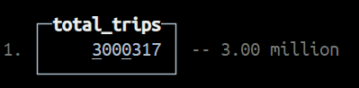
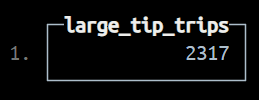
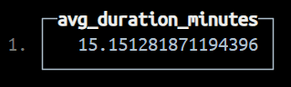
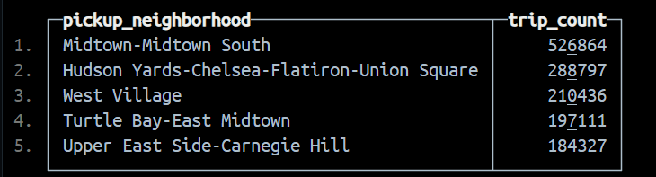

# Предварительные требования:
+ Установленный Docker
# Домашняя работа по теме Колоночные (аналитические) базы данны(Тема 4):
## 1.Контейнер:
Запускаем контейнер с clickhouse:    
```bash
docker run -d --name clickhouse-server -p 9000:9000 -p 8123:8123 clickhouse/clickhouse-server:latest
```    
Используем контейнер:    
```bash
docker exec -it clickhouse-server clickhouse-client
```
## 2.Создание таблицы и загрузка данных
Создаём базу данных и таблицу trips:
```sql
CREATE DATABASE nyc_taxi;

CREATE TABLE nyc_taxi.trips_small (
    trip_id             UInt32,
    pickup_datetime     DateTime,
    dropoff_datetime    DateTime,
    pickup_longitude    Nullable(Float64),
    pickup_latitude     Nullable(Float64),
    dropoff_longitude   Nullable(Float64),
    dropoff_latitude    Nullable(Float64),
    passenger_count     UInt8,
    trip_distance       Float32,
    fare_amount         Float32,
    extra               Float32,
    tip_amount          Float32,
    tolls_amount        Float32,
    total_amount        Float32,
    payment_type        Enum('CSH' = 1, 'CRE' = 2, 'NOC' = 3, 'DIS' = 4, 'UNK' = 5),
    pickup_ntaname      LowCardinality(String),
    dropoff_ntaname     LowCardinality(String)
)
ENGINE = MergeTree
PRIMARY KEY (pickup_datetime, dropoff_datetime);
```    
Загружаем данные прямо из публичного бакета:    
```sql
INSERT INTO nyc_taxi.trips_small
SELECT
    trip_id,
    pickup_datetime,
    dropoff_datetime,
    pickup_longitude,
    pickup_latitude,
    dropoff_longitude,
    dropoff_latitude,
    passenger_count,
    trip_distance,
    fare_amount,
    extra,
    tip_amount,
    tolls_amount,
    total_amount,
    payment_type,
    pickup_ntaname,
    dropoff_ntaname
FROM gcs(
    'https://storage.googleapis.com/clickhouse-public-datasets/nyc-taxi/trips_{0..2}.gz',
    'TabSeparatedWithNames'
);
```
## 3.Выполняем запросы:
### 3.1 Общее кол-во поездок
**Запрос:**    
```sql
SELECT count(*) AS total_trips 
FROM nyc_taxi.trips_small;
```    
**Результат:**    


### 3.2 Поездки с крупными чаевыми
**Запрос:**    
```sql
SELECT count(*) AS large_tip_trips 
FROM nyc_taxi.trips_small 
WHERE tip_amount > 20;
```    
**Результат:**    


### 3.3 Средняя продолжительность поездки в минутах
**Запрос:**    
```sql
SELECT avg((dropoff_datetime - pickup_datetime) / 60) AS avg_duration_minutes
FROM nyc_taxi.trips_small 
WHERE pickup_datetime < dropoff_datetime;
```    
**Результат:**    


### 3.4 5 самых популярных зон для начала поездки
**Запрос:**    
```sql
SELECT pickup_ntaname AS pickup_neighborhood,
count(*) AS trip_count
FROM nyc_taxi.trips_small
WHERE pickup_ntaname != ''
GROUP BY pickup_ntaname
ORDER BY trip_count DESC
LIMIT 5;
```    
**Результат:**    


### 3.5 Топ-3 дня с наибольшей выручкой
**Запрос:**
```sql
SELECT toDate(pickup_datetime) AS trip_date, sum(total_amount) AS total_revenue
FROM nyc_taxi.trips_small
WHERE pickup_datetime IS NOT NULL
GROUP BY trip_date
ORDER BY total_revenue DESC
LIMIT 3;
```
**Результат:**

